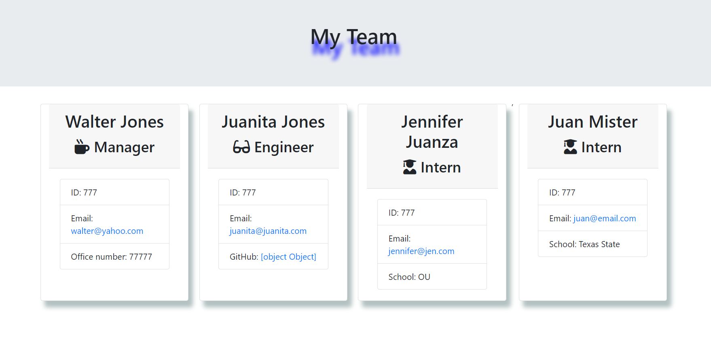

# Employee Summary

## Application Description

This app  allows  managers to create software engineering teams composed of mulitiple members. The various team members are added by the manager and details such as name, id, title, email address, office number, and title are collected and added for each.  The output  is a list of the various team members displayed in your browser.  

## Table of Contents

* [Installation](#installation)
* [Usage](#usage)
* [Credits](#Credits)
* [Walkthrough](#Walkthrough)
* [License](#license)
* [Links](#links)

## Installation

From your terminal, run app.js

## Usage

Follow the promps and answers all the questions, then a list of your newly added team members will generated and displayed on any browser.

## Credits

Teacher Assistants, w3schools.com, css-tricks, Visual Code; and most importantly, positive vibes and motivation from friends.

## Walkthrough

## License

This application is covered under the MIT license, please see [license.txt](license.txt) for more details.

## Links

* Video Walkthrough URL: https://drive.google.com/file/d/1tGusTEEaZXqMXxtL550I8NOJinMBXBN8/view?usp=sharing

* Github Repo URL: https://github.com/Waltrevino/employee_summary